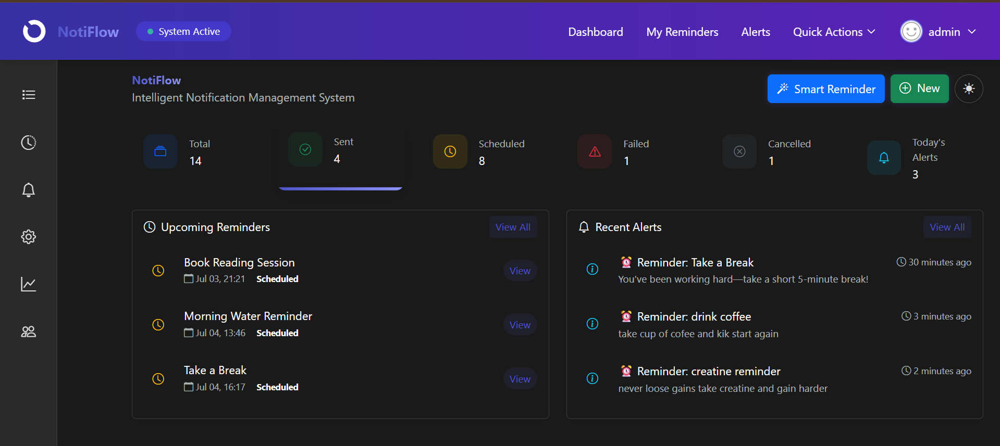
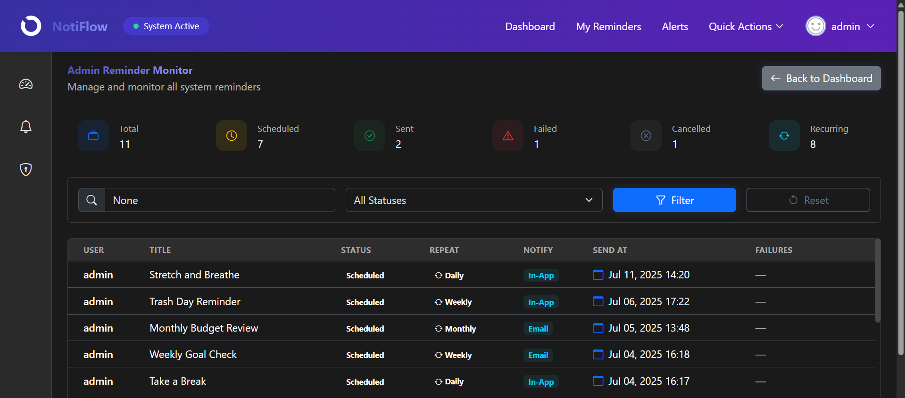
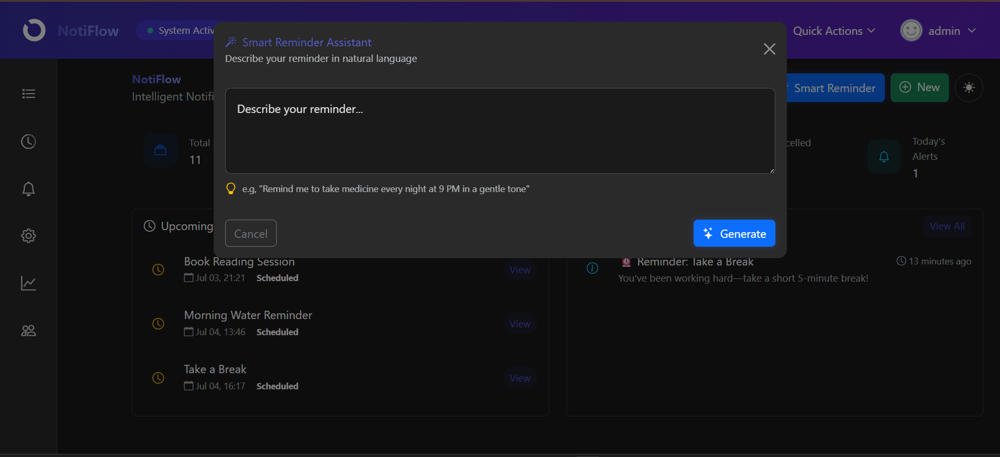
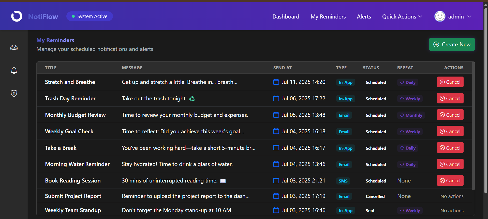
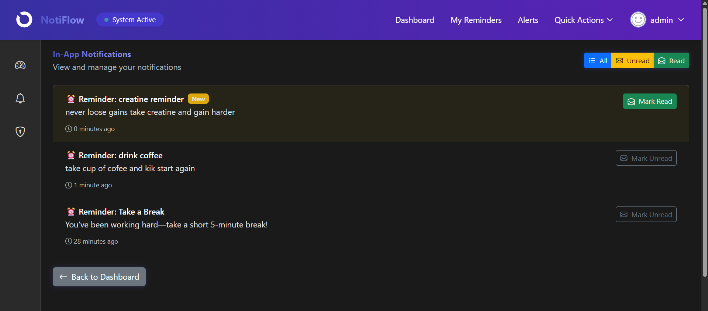
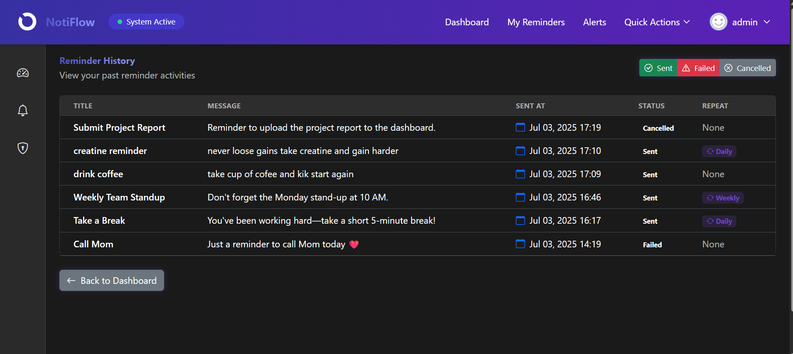
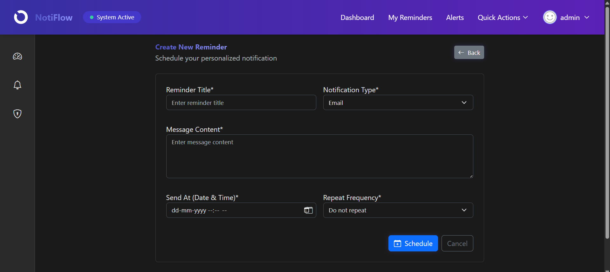

#  Notiflow – AI-Powered Smart Reminder & Notification System

Notiflow is a Django project that combines scheduled tasks, notifications, and AI capabilities. It helps users stay productive by automating reminders via **email**, **in-app**, and **SMS**, powered by **Celery, Redis**, and **LLMs (via Groq/OpenAI)**.

---

##  Features

###  AI Automation

*  **Natural Language Reminder Parser** (e.g. "Remind me to drink water daily at 9 AM")
*  **Tone-Adjusted Reminders** using LLM (rewrite in friendly/formal tone)
*  **Weekly Smart Suggestions** via AI (analyzes your usage + suggests habits)

###  Multi-Channel Notifications

*  Email Notifications (via SMTP)
*  In-App Notifications (with HTMX)
*  SMS Notifications (Twilio Integration)

###  Scheduling System (Celery + Beat)

*  Schedule reminders one-time or recurring (daily, weekly, monthly)
*  Celery Beat for periodic tasks like:
  * Weekly analytics
  * Failed job retries
  * Reminder cleanup
*  Retry logic, task monitoring, failure alerts

###  Admin & Monitoring

*  Admin dashboard for all user reminders
*  Weekly analytics for users via email
*  Reminder history tab
*  Logs for failures with auto-alert to admins
*  Flower dashboard for Celery task monitoring

###  Technology Stack

| Stack      | Tools Used                                     |
| ---------- | ---------------------------------------------- |
| Backend    | Django, Celery, Celery Beat                    |
| Database   | PostgreSQL 17 (with SQLite fallback)           |
| Queue      | Redis                                          |
| Frontend   | HTMX, Crispy Forms, Bootstrap                  |
| AI Layer   | Groq / OpenAI APIs                             |
| Email      | SMTP (Gmail configured)                        |
| SMS        | Twilio API                                     |
| Monitoring | Flower (Celery monitoring dashboard)           |
| DevOps     | Docker, Docker Compose, Gunicorn, Whitenoise   |
| Auth       | django-allauth                                 |
| API        | Django REST Framework                          |

---

##  Demo Screenshots

| Screenshot                                                  | Description                                                          |
| ----------------------------------------------------------- | -------------------------------------------------------------------- |
|            |  **User Dashboard** – Overview of reminders, alerts, and activity  |
|          |  **Admin Panel** – Monitor all user reminders and failures         |
|            |  **AI Reminder Creation** – Natural language input + LLM rewriting |
|              |  **Reminder List View** – Upcoming and past reminders              |
|  |  **In-App Notifications** – List of all in-app notifications     |
|        |  **History Tab** – Log of all completed and failed reminders       |
|              |  **Manual Reminder Form** – Traditional form-based entry           |

---

##  Project Setup

### Using Docker Compose (Recommended)

\\\ash
# Build and start all services
docker-compose up -d

# Services running:
# - Django app on http://localhost:8001
# - PostgreSQL on localhost:5432
# - Redis on localhost:6379
# - Flower (Celery monitoring) on http://localhost:5555 (admin/password123)
# - Celery worker
# - Celery Beat scheduler

# Run migrations inside the container
docker-compose exec app python manage.py migrate

# Create superuser
docker-compose exec app python manage.py createsuperuser

# View logs
docker-compose logs -f app
\\\

### Local Development Setup

\\\ash
# Setup virtualenv
python -m venv .venv
.venv\Scripts\activate  # On Windows

# Install dependencies
pip install -r requirements.txt

# Setup environment variables
# Create .env file with your API keys:
# - EMAIL_HOST_USER, EMAIL_HOST_PASSWORD
# - GROQ_API_KEY or OPENAI_API_KEY
# - TWILIO_ACCOUNT_SID, TWILIO_AUTH_TOKEN, TWILIO_PHONE_NUMBER
# - CELERY_BROKER_URL, CELERY_RESULT_BACKEND (Redis)

# Run migrations
python manage.py migrate

# Start Redis
redis-server

# In separate terminals, run:
python manage.py runserver
celery -A notiflow worker --loglevel=info
celery -A notiflow beat --loglevel=info

# Create admin user
python manage.py createsuperuser
\\\

---

##  Environment Variables (.env)

\\\env
SECRET_KEY=your-django-secret-key
DEBUG=True
ALLOWED_HOSTS=127.0.0.1,localhost

# Email
EMAIL_HOST_USER=your@email.com
EMAIL_HOST_PASSWORD=yourpassword

# Redis / Celery
CELERY_BROKER_URL=redis://localhost:6379/0
CELERY_RESULT_BACKEND=redis://localhost:6379/0

# Twilio
TWILIO_ACCOUNT_SID=...
TWILIO_AUTH_TOKEN=...
TWILIO_PHONE_NUMBER=...

# AI - Groq
GROQ_API_KEY=sk-...
\\\

---

##  Flower – Celery Monitoring

Flower provides a real-time monitoring dashboard for Celery tasks:

- **URL**: http://localhost:5555
- **Username**: admin
- **Password**: password123

Monitor task execution, failures, and retries in real-time via the web interface.

---

##  Sample Natural Language Prompts

>  "Remind me to take a break every day at 4 PM in a friendly tone"
>  "Set a weekly status update reminder next Monday 10 AM"
>  "I want to review goals monthly on the 1st in a formal tone"

---

##  Use Cases

* Task scheduling & deadline reminders
* Wellness nudges via AI
* Scheduled email notifications
* Background job orchestration with Celery
* Real-time task monitoring with Flower

---

##  Author

> **Dhiraj Durgade**
> Python  Django  Full Stack Dev
> [LinkedIn](https://www.linkedin.com/in/dhiraj-durgade/)  [GitHub](https://github.com/dhirajdurgade7758)

---

##  Want to Contribute?

* Clone this repo
* Create a feature branch
* Submit a PR 

---

##  Key Features & Notes

* **Docker-ready**: Full Docker Compose setup with PostgreSQL, Redis, and Celery
* **Celery Beat scheduler** for periodic tasks, retries, and cleanup
* **Flower dashboard** for real-time Celery task monitoring
* **HTMX** for interactive frontend without heavy JavaScript
* **AI-powered reminders** via Groq or OpenAI APIs
* **REST API** for third-party integrations
* **Admin panel** for managing reminders and monitoring failures
